# Adaptive Airflow Support Intelligence Platform

A local proof of concept for investigating Airflow failures and performing
engineer-reviewed remediation. It combines actual Airflow evidence, a synthetic-data
Random Forest classifier, SHAP explanations, deterministic evidence rules, optional
LLM reasoning and runbooks in a React operations console.

**Current documentation: 6 October 2026.** New supported DAGs can use the source
review and execution workflow without registering their names or adding predefined
patches. Human approval and explicit execution are required before applying a fix.

## What the supervisor can evaluate

- Analyze failed DAG runs and DAG import errors using Airflow evidence.
- Inspect Summary, Timeline, Evidence, Intelligence and Runbook views.
- Compare ML, evidence-rule and LLM contributions without hiding missing data.
- Ask Developer Copilot to investigate actual task source and propose a correction.
- Review/edit a source diff, validate it and approve its exact revision/hash.
- Explicitly apply the approved change, verify a corrected run and inspect the audit.
- Submit Engineer Feedback and reopen persisted reviews/results after navigation.

Incident classes include Scheduler, DAG Parsing, Resource, Kubernetes,
Configuration, Application Code and Unknown. Application Code is supported by the
hybrid/evidence layer; this does not imply the original ML model was retrained.
SHAP explains model contributions, not causal proof. Deterministic confidence is
rule strength, not calibrated causal probability.

```mermaid
flowchart LR
    A[Airflow API and task logs] --> B[FastAPI evidence collection]
    B --> C[ML and SHAP / evidence rules / optional LLM]
    C --> D[Investigation and runbooks]
    D --> E[Developer Copilot and actual DAG source]
    E --> F[Engineer review, validation and exact-version approval]
    F --> G[Explicit execution: backup, apply, parse, trigger, verify]
    G --> H[Persisted review, audit and feedback]
```



## Prerequisites and repository layout

The main instructions below use **Windows PowerShell** and run the backend/frontend
on the host. Replace `D:\Projects` with your own parent directory consistently.

| Requirement | Notes |
| --- | --- |
| Python 3.12 | Development environment checked with 3.12.10; use the pinned backend dependencies. |
| Node.js 22.12+ and npm | Development environment checked with Node 22.22.3. |
| A running, compatible Airflow 3 environment | Must expose token authentication and `/api/v2` endpoints for evidence, source/version inspection and triggering. The separate local Compose file specifies Airflow 3.3.1. |
| Local access to its DAG source directory | Airflow and this backend must see the same files. Application needs write access. |
| A configured Gemini, OpenAI or Ollama provider | Required for ordinary AI source proposals; evidence-only analysis can work without an LLM. |
| Docker Desktop/Compose | Needed only if using the separate containerized Airflow environment. |
| Chrome and Python Playwright | Optional: browser regression tests. |

```text
D:/Projects/
  airflow/                         Separate Airflow environment
    docker-compose.yaml
    dags/                          Actual files parsed by Airflow
  airflow-support-intelligence/    This repository
    backend/app/                   FastAPI and remediation services
    backend/models/                Included trained model bundle
    backend/data/                  Synthetic training dataset
    frontend/                      React/Vite console
    demo_dags/                     Intentionally failing sample source
    runbooks/                      Investigation guidance
    data/                          Local runtime stores and source backups
    tests/                         Isolated backend/browser tests
    docs/                          Detailed design and verification reports
```

**Airflow itself is not provisioned by this repository.** On another machine,
prepare the separate Airflow environment first (or obtain the project's separate
Airflow Compose setup from the author). Confirm its credentials, API port and DAG
bind mount. In the author's setup, `./dags` is mounted at `/opt/airflow/dags` and
Airflow is exposed on host port `8088`. A fresh Airflow deployment also needs its
own database initialization and user setup before these instructions can connect.

The root `docker-compose.yml` in **this** repository references prebuilt support-app
images. It does not start Airflow or configure the shared writable DAG directory,
LLM settings and persistent stores for this complete workflow. Use the host setup
below for the documented evaluation; a fresh clone is not a one-command Docker demo.

## 1. Install the support application

Obtain this repository and open PowerShell in its root. Ensure the supplied copy
includes all current source files, `frontend/package-lock.json`,
`backend/models/incident_classifier.joblib` and the demo DAGs.

```powershell
cd D:\Projects\airflow-support-intelligence
py -3.12 -m venv .venv
.venv/Scripts/python.exe -m pip install -r requirements.txt
cd frontend
npm.cmd ci
cd ..
```

No virtual-environment activation is required when using these commands.
The model and synthetic dataset are included; retraining is not required to start.
Only if intentionally rebuilding the model, run `ml/generate_data.py` followed by
`ml/train.py` with the virtual-environment Python. These overwrite generated artifacts.

## 2. Configure the backend

Create a local environment file **without overwriting an existing one**:

```powershell
if (-not (Test-Path .env)) { Copy-Item .env.example .env }
```

Edit `.env` locally:

```dotenv
AIRFLOW_API_URL=http://localhost:8088
AIRFLOW_USERNAME=your-local-airflow-username
AIRFLOW_PASSWORD=your-local-airflow-password
AIRFLOW_DAG_SOURCE_ROOT=D:/Projects/airflow/dags

LLM_PROVIDER=gemini
GEMINI_API_KEY=your-own-api-key
GEMINI_MODEL=your-accessible-model-id
LLM_FALLBACK_PROVIDERS=
```

Use your actual Airflow credentials and a model available to your provider account.
The example file contains the project's previously tested model setting; availability,
quota and latency are account-dependent. See [provider setup](docs/llm-setup.md) for
Gemini, Ollama and OpenAI configuration. Do not send API keys or your `.env` with the project.

For evidence-only analysis, set `LLM_PROVIDER=none`. It does **not** generate ordinary
AI source corrections. Two bundled demos have an explicitly opted-in, visibly labelled
fallback for testing infrastructure; it is not AI-generated and is not available for
arbitrary new DAGs. Keep the fallback unchecked when evaluating real AI proposals.

Existing terminal environment variables override `.env`. For example, if a previous
test set a terminal override, remove it before starting the backend:

```powershell
Remove-Item Env:LLM_PROVIDER -ErrorAction SilentlyContinue
```

Changing `.env` requires restarting the backend. The source root must be the actual
local directory shared with Airflow, not this repository's `demo_dags` directory.

## 3. Start services and check connectivity

If using the already initialized separate Airflow stack, start it in terminal A:

```powershell
cd D:\Projects\airflow
docker compose up -d
```

Start the backend in terminal B:

```powershell
cd D:\Projects\airflow-support-intelligence
.venv/Scripts/python.exe -B -m uvicorn backend.app.main:app --reload --env-file .env
```

Start the frontend in terminal C:

```powershell
cd D:\Projects\airflow-support-intelligence\frontend
npm.cmd run dev
```

| Service | Local URL |
| --- | --- |
| Airflow | http://localhost:8088 |
| Support console | http://localhost:5173/#/overview |
| Backend health | http://localhost:8000/health |
| Interactive API documentation | http://localhost:8000/docs |

Use the frontend port printed by Vite if it differs. Vite proxies `/api` to the
backend on `127.0.0.1:8000`. Keep one backend instance for the local JSON stores.

In another terminal, check the API and Airflow connection:

```powershell
Invoke-RestMethod http://localhost:8000/health
Invoke-RestMethod http://localhost:8000/airflow-catalog
```

Backend health alone does not prove the Airflow credentials work; the catalog check
must also succeed. No DAG is triggered by these checks. Stop host services with
Ctrl+C in their terminals when finished; do not stop them during an execution.

## 4. First end-to-end evaluation: customer discounts

Use the included [customer-discount DAG](demo_dags/support_intelligence_customer_discount_remediation_demo.py).
It contains three customers and intentionally calls `.lower()` on a missing tier.
The business rule is gold=20%, silver=10%, missing/invalid tier=no discount.

### Install the intentionally failing source

From the repository root, set the same source directory as `.env`, then install:

```powershell
$env:AIRFLOW_DAG_SOURCE_ROOT = 'D:/Projects/airflow/dags'
.venv/Scripts/python.exe -B scripts/reset_code_remediation_demo.py --confirm-reset --dag-id support_intelligence_customer_discount_remediation_demo
```

The reset script does not load `.env` itself. Check its printed target path. It
backs up an existing file before restoring the buggy baseline; it does not trigger
Airflow. Run it only when no review execution for this DAG is active.

### Create and investigate the failure

1. In Airflow, wait for `support_intelligence_customer_discount_remediation_demo`
   to appear, unpause it if necessary, and trigger it with `{}`.
2. Wait for failure. In `calculate_customer_discounts` logs, confirm
   `AttributeError: 'NoneType' object has no attribute 'lower'`.
3. In the support console, open **Incidents**, **Refresh catalog**, search for
   `customer_discount`, then **Open incident** and **Analyze Live Airflow**.
4. Confirm the selected run ID and evidence. Expected class: **Application Code**.
   With insufficient ML features and unavailable LLM, the existing deterministic
   path reports **EVIDENCE_SIGNAL_FALLBACK** and human review. A configured LLM can
   produce another decision mode; missing ML features should not be invented.
5. Inspect **Summary**, **Timeline**, **Evidence**, **Intelligence** and **Runbook**.

### Request and review a correction

Open the incident's **Developer Copilot**, leave demo fallback unchecked, and send:

```text
Investigate the latest failed customer-discount run using its actual source
and exception. Propose a minimal correction for missing customer tiers.
Preserve all three customer records, imports, function signature and DAG/task
declarations. Gold receives 20%, silver 10%, and missing, blank or non-string
tiers receive no discount. Do not add recovery modes. Explain evidence,
risks and tests.
```

6. Inspect the provider diagnostics, reasoning and proposed change. Follow
   **Review Proposed Change** from this new response, not an old completed review.
7. In **Source & diff**, inspect the original source, proposed source, provenance,
   saved revision/hash and exact diff. Preserve the customer with `None`.
8. If you edit, click **Save Reviewed Version**. Otherwise the proposal is already
   saved and that button may be disabled. Click **Validate Changes**.
9. Open **Validation & approval**, inspect checks, enter a reviewer name, select
   **L2**, and click **Approve Reviewed Change**. Confirm the exact DAG/revision/hash.
   Editing afterward invalidates validation and approval.

### Execute, verify and record feedback

10. Open **Execution & feedback** and explicitly confirm **Execute Approved
    Remediation**. This backs up and writes source, waits for Airflow recognition,
    triggers a corrected run with `{}`, and verifies it. Approval alone does not execute.
11. Wait for `succeeded` and `Verification: verified`. Open the corrected run ID
    in Airflow and check its task logs and business results:

| Customer | Expected final total |
| --- | ---: |
| CUST-1001 | 400.0 |
| CUST-1002 | 270.0 |
| CUST-1003 | 250.0 |

The logs should also report `ProcessedCustomers=3`. The original failed run remains
failed; successful remediation creates a separate run.

12. Submit **Useful/Not Useful**, required **Change quality**, and an optional comment.
    Confirm **Feedback saved successfully**. Feedback does not execute anything or retrain ML.
13. Navigate away, then open **Source Reviews**, find this review and choose
    **View Result**. Reload and confirm persisted results/feedback. Inspect **Audit**.

## 5. Repeat a demonstration or use a new DAG

For a repeat bundled demo, restore its baseline with the explicit reset command,
wait for Airflow's source view to reflect it, and trigger a fresh failure. Start a
**new investigation and proposal**. Do not reuse an old approved/completed review.
Source Reviews intentionally preserves historical results; its **Start a new
investigation** link returns to the incident workspace. Do not delete history to repeat a demo.

New DAGs do not require a registry entry or handcrafted patch. Supported scope:

- File is `<dag_id>.py` directly under the configured trusted source root.
- One static matching DAG ID and a static task ID mapped through `python_callable`
  to an unambiguous existing top-level function in that file.
- One function-body correction, preserving imports, declarations, signature and
  existing literal input datasets. Multiple tasks may be present.
- A valid AI proposal, exact-version validation/approval and explicit execution.
- Airflow can expose matching source/version information and run it with `{}`.

Add a new source file yourself, trigger its failure, then follow the same UI steps.
The reset script is only for its two bundled fixtures. Dynamic/generated identities,
TaskFlow or imported/shared callables without this mapping, multiple DAGs per file,
and multi-file/import changes are not automatically executable. The UI shows the
policy reason. See [general source execution](docs/general-source-execution.md).

Old policy-version-1 reviews remain readable but cannot gain new execution permissions.
Generate a new proposal after upgrading. Static checks are not a Python sandbox and
cannot prove business correctness; inspect any code and external effects before approval.

## Console navigation

| View | Purpose |
| --- | --- |
| Overview | Actual API/catalog status, session investigations and saved source activity |
| Incidents | Search DAGs/import errors and explicitly analyze latest evidence |
| Investigation | Summary, Timeline, Evidence, Intelligence, Runbook |
| Developer Copilot | Source/evidence investigation and proposal generation |
| Remediation | Separate source investigation and operational action workflows |
| Source Reviews | Persisted proposals, revisions and completed results |
| Audit & feedback | Persisted source activity and feedback references |
| Manual evidence tool | Separate manual ML input analysis |

Detection polls for failures and displays a notice; it does not silently switch your
active incident or execute remediation. Operational actions are distinct from source
writes. Do not assume a DAG implements `mode=recovery`; most application-code demos do not.

## Troubleshooting

| Symptom | Check or next step |
| --- | --- |
| Airflow catalog fails | Airflow server, API URL/port, credentials and authentication. |
| DAG missing | Correct directory/bind mount, parsing delay, Airflow import errors, then Refresh catalog. |
| Source cannot be resolved | `AIRFLOW_DAG_SOURCE_ROOT`, matching filename/DAG ID, local access and no links/traversal. |
| ML says insufficient features | Actual telemetry is missing; inspect evidence-rule/LLM attribution instead. |
| No AI proposal / quota error | Provider diagnostics, key/model/quota or local Ollama availability. Do not relabel fallback as AI. |
| Old successful workflow appears | It is a saved Source Review. Start a new investigation, analyze the new failed run and request a fresh proposal. |
| Validation/approval blocked | Read the policy/check errors; preserve scope/data, save edits, validate, enter reviewer, use a new policy-version-2 proposal. |
| Source changed / stale proposal | Investigate current source and create a fresh proposal. Do not force an old approval. |
| Parse or execution failed | Inspect audit, backup and Airflow state. No automatic retry; do not repeatedly trigger/reset. |
| Feedback disabled | Wait for terminal remediation and saved-state load; choose both usefulness and change quality. |
| Settings seem ignored | Terminal variables override `.env`; restart the backend after configuration changes. |

## Tests and evidence

Last complete recorded verification (6 October 2026): **260 passed, 0 failed,
0 skipped**, including **10 browser scenarios**; frontend lint/build passed.
There were four dependency deprecation warnings. This is regression evidence, not
an assertion that every external provider or deployment has been live-tested.

Backend tests (browser cases are opt-in):

```powershell
.venv/Scripts/python.exe -B -m pytest tests -q -p no:cacheprovider
```

Optional complete run, with Chrome installed:

```powershell
.venv/Scripts/python.exe -m pip install playwright
cd frontend
npm.cmd run lint
npm.cmd run build
cd ..
$env:RUN_BROWSER_TESTS = '1'
.venv/Scripts/python.exe -B -m pytest tests -q -p no:cacheprovider
Remove-Item Env:RUN_BROWSER_TESTS
```

Browser tests serve the built frontend and use temporary stores/source roots and
simulated Airflow/provider responses. They do not need a live Airflow instance or
real API key. A before/after fingerprint guard checks the sibling local DAG directory;
leave those files unchanged during a test run. Do not run demo resets concurrently.

## Persistence, limitations and sharing

Reviews, actions and feedback use local JSON stores; source backups live under
`data/source_backups`. Keep one backend process. Session analysis/chat and unsaved
editor drafts are not durable: save reviewed source before leaving. Latest-run
analysis is supported; the UI is not a historical-run selector.

This is a trusted-local PoC, not a production authorization or sandbox system.
Reviewer roles are self-declared. Source execution can change real DAG files and
trigger work when explicitly confirmed. Evaluate with synthetic, repeatable DAGs.
Real Kubernetes/Prometheus telemetry integration, authenticated multi-user operation,
database persistence and broader source layouts remain future work. The original
ML dataset is synthetic; model metrics must not be represented as production accuracy.

Before sending the project, ensure the current implementation is included: a Git
clone contains committed files only. Do not send `.env`, keys, `.venv`, `node_modules`,
private logs, local backups or personal runtime histories. If sharing the separate
Airflow setup, remove its secrets and explain its initialization/credentials separately.
The local `data/actions.json` may contain history; review sharing contents deliberately.

## Further reading

- [General source execution: current policy and supported scope](docs/general-source-execution.md)
- [UI redesign and verification report](docs/ui-redesign.md)
- [Application Code classification](docs/application-code-classification.md)
- [LLM configuration and provider diagnostics](docs/llm-setup.md)
- [General AI investigation design](docs/general-ai-remediation.md)

Older reports retain historical test counts and implementation decisions; the current
source-execution policy above supersedes their original two-demo write restriction.

## Author

**Dasun Sandeepa**

Intern - Software Engineer, Airflow Support, iVedha Inc.

## License

This project is intended for research, educational, and proof-of-concept purposes.
